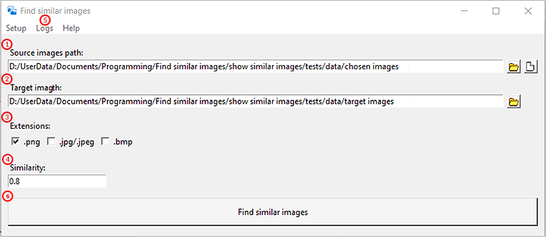
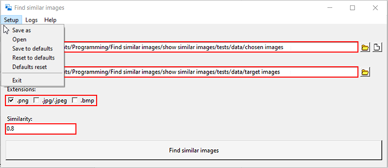

<h1 align="center">Show Similar Images</h1>

 This program shows similar images in the given folder
 
 

## Getting Started 💡

Run `python Show_Similar_Images` command line in the directory where the folder exists

To run only the UI version you don't have to provide any arguments, just press the "Enter"

If you want to use the console: [**How to use console**](docs/How_to_use_console.md)

standalone exe version of a program is here: [link](https://gofile.io/d/DlYQ0I)

You can also create your executable: [link](https://www.youtube.com/watch?v=UZX5kH72Yx4)

## Using UI version 👀

1. Choose a folder with images to compare each image to another, 
   or an image file/ images folder to compare with the target folder.
2. (Optional) Choose target folder.
3. Pick at least one desired file extension checkbox.
4. Write similarity value between 0.0 and 1.0
5. If you want to log result, check if in Logs menu is: `Save logs: True`
6. Finally, push the "Find similar images" button to find out the results.
7. **Enjoy** the results!

## Setup 💾

The areas marked **in red** are **options** which can be **saved**, **loaded** as setup files  
Setups are stored in `Show_Similar_Images/appData/`

To process setups, in menu **"Setup"** are located following options:

1. **Save as**, save current setup into **.ini** file
2. **Open**, open setup **.ini** file
3. **Save to defaults**, save current setup as **defaults** (**load that** setup each time when **program starts**)
4. **Reset to defaults**, load **defaults**
5. **Defaults reset**, overwrite **defaults** to **standard** values and **load** them

## Logs 📜

In this menu, you can choose if **founded similar images logs** appear or not  
the **Logs** are saved in the image directory

## Help ℹ️

It consists of:

- How to use the program
- About (the program and its creator)

## Program config 🕹️

In `./Show_Similar_Images/config/` you will find constants  
used through the whole program

## Running the tests 🧪

To run tests, write down in the terminal, in the program folder:
`python test.py`

## Built With 🧰

- [**Required packages and Python ver**](Pipfile) - [How to use pipenv (virtual machine)](https://pipenv-fork.readthedocs.io/en/latest/basics.html)

- [**Install packages on your computer**](requirements.txt) - [How to use pip](https://pip.pypa.io/en/latest/user_guide/#requirements-files)

## Needed documentation 📦

- [**image-match**](https://image-match.readthedocs.io/en/latest/index.html)

## Structure of the code 🧭

[**Flow diagram**](docs/images/simpified_model_of_program.png)

## Contributing 📬

Please read [**CONTRIBUTING.md**](docs/CONTRIBUTING.md) for details on our code of conduct, and the process for submitting pull requests to us

## Versioning 🗓️

We use [**SemVer**](http://semver.org/) for versioning in [**CHANGELOG.md**](docs/CHANGELOG.md)

## Authors 🎈

- **Karol Łukaszczyk** - _Initial work_ - [**Luk-kar**](https://github.com/Luk-kar)

## License 📜

This project is licensed under the MIT License - see the [**LICENSE**](docs/LICENSE) file for details

## Acknowledgments 👍

- _README-template.md, CONTRIBUTING-template.md_ by [**PurpleBooth**](https://gist.github.com/PurpleBooth)
